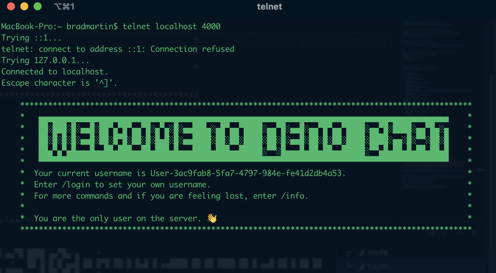
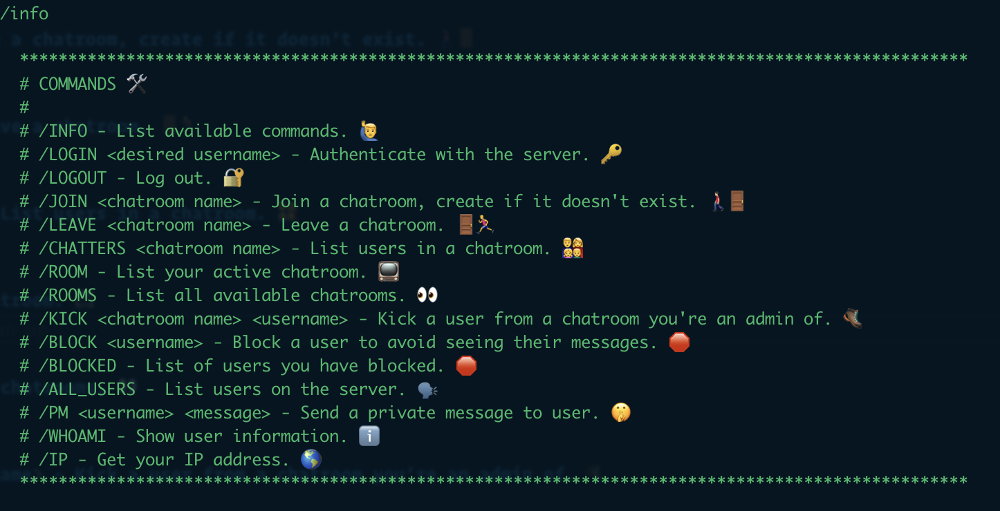

# Chat Server written in TS running with Deno



## Outline

- Run this project (see development section below) on your machine (the server).
- In a terminal `telnet localhost <port>` - Default port for this project is 8080 (more below to pass the port argument).
- Once you are connected via telnet to the server. You will see a welcome message on the next steps. Everything should work well enough with simple UX that no further instructions are needed.
- However, this is what should happen :)
  -- You should be informed of rooms on the server and told to login. After you `/login` with a username, you can then join or create chatrooms.
  -- `/join <chatroom>` will join an existing room or will create a new chatroom and you will be the admin of the room allowing you to kick other users from the chatroom with the `/kick <chatroom> <username>` command.
  -- There also exists a `/block <username>` command which will prevent you from receiving any messages from the blocked user.
  -- Private message functionality exists to send messages private and directly to the user specified with `/pm <username> <your message>`. This is also in sync with the blocked users. So if you have someone blocked, you should not receive messages from them.

A full list of the commands are below in the "Server Commands" section. If you want to browse the commands while connected to the server. Enter `/info` and a list will print to make it easier to find the various options.

## Setup

You will need Deno installed. [Installation Guide here.](https://deno.land/#installation)

```bash
// to insall on mac with homebrew
brew install deno
```

If you have `npm` installed you can use some npm scripts below, if not the deno commands work just fine (see package.json scripts for more).

## Development

`deno run --allow-all --watch=./**/*.ts ./main.ts -p 4040`.
or with npm
`npm run dev`

- This will build and start the server. Default port is 8080. If you pass the `-p <value>` argument you can set the port to listen on.

## Build Executables (Unstable in Deno right now)

`deno compile --allow-all --output=./build/chat_server ./main.ts`
or with npm
`npm run build`

## Server Commands



#### /INFO - List available commands. 🙋‍♂️

#### /LOGIN <desired username> - Authenticate with the server. 🔑

#### /LOGOUT - Log out. 🔐

#### /JOIN <chatroom name> - Join a chatroom, create if it doesn't exist. 🚶🏻‍♂️🚪

#### /LEAVE <chatroom name> - Leave a chatroom. 🚪🏃‍♂️

#### /CHATTERS <chatroom name> - List users in a chatroom. 👨‍👩‍👧‍👦

#### /ROOM - List your active chatroom. 📺

#### /ROOMS - List all available chatrooms. 👀

#### /KICK <chatroom name> <username> - Kick a user from a chatroom you're an admin of. 🥾

#### /BLOCK <username> - Block a user to avoid seeing their messages. 🛑

#### /BLOCKED - List of users you have blocked. 🛑

#### /ALL_USERS - List users on the server. 🗣

#### /PM <username> <message> - Send a private message to user. 🤫

#### /WHOAMI - Show user information. ℹ️

#### /IP - Get your IP address. 🌎

---

### Dependencies

- No external dependencies.

### Why Deno

Deno being stable for some time now and its creators being the same as the original creators of Node makes it a very exciting and potentially strong framework moving forward. Its first class TS support made everything fairly simple to get up and running. You can read more about [Deno here](https://deno.land/).
